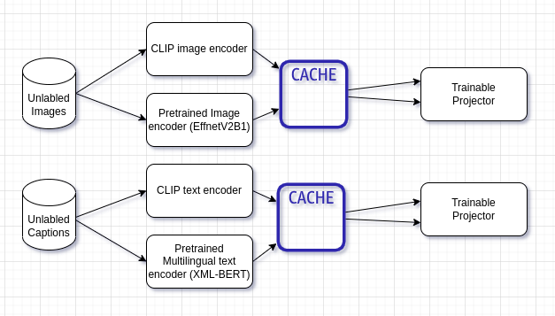

# eff-mclip
Experiments to achive a efficient multilingual clip image and text encoding architecture.

(OpenAI CLIP)[https://github.com/openai/CLIP] works great but requires a large amount of labled training data as well as having rather large models for text and image encoding.
In an attempt to get similar quality results while keeping the parameter count low we propose following experiments:

## Knowledge distillation of both the text and image encoders using pretrained backbones
By using a frozen pretrained small image and text encoder followed by a projection head we can perform distillation of the large models. By using pretrained encoders the features of images/text aren't re-learned, instead only the latent space is aligned with the CLIP.
Precomputing the embeddings using clip and the student backbone allows efficient training of the projectors with a large batch size.

## Datasets used
cc3m (contextual captions 3 million) for ~3 million image captions
oidv6 (open image dataset V6) for 1.9 million images

